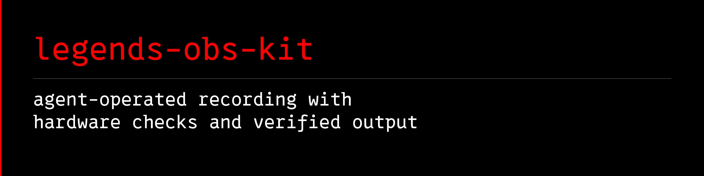

<a name="banner"></a>
<a name="legends-obs-kit"></a>

# 

[](https://github.com/avalonreset/legends-obs-kit/releases/latest)
[](https://github.com/avalonreset/legends-obs-kit/actions/workflows/ci.yml)
[](LICENSE)

legends-obs-kit is a guarded, agent-friendly CLI and skill for inspecting, configuring, operating, and proving OBS Studio on Windows. It uses OBS's built-in WebSocket v5 API, local OBS logs, and FFprobe—no ambient MCP server and no UI click macros.

Ask your agent to inspect your recording setup, explain what changed since a
known-good recording, or plan a hardware-appropriate profile. The kit keeps
rollback snapshots and checks the resulting recording instead of treating a
successful settings change as proof that the output works.

[install a release](#install-a-release) · [first run](#first-run) ·
[recipes](docs/RECIPES.md) · [troubleshooting](docs/TROUBLESHOOTING.md) ·
[agent setup](docs/AGENTS-MATRIX.md) · [settings history](docs/AUDIT-LEDGER.md)

The universal core is hardware-neutral:

- authenticated status, scene, source, output, and profile inventory;
- per-machine settings and capability ledgers with exact drift detection;
- dry-run plans, rollback snapshots, bounded mutations, and readback;
- local recording control and FFprobe-backed canaries;
- optional microphone health/repair and deterministic scene switching.

Scene mutations currently target OBS's main canvas. `doctor` reports an advisory warning when multiple canvases make that scope ambiguous.

Bundled recording presets are opt-in examples, not universal recommendations. `doctor` reports encoder, HDR, FFprobe, recording-path, and microphone readiness as hardware-neutral capability summaries; those checks become requirements only for commands that need them.

## Requirements

- Windows 10 or 11
- OBS Studio 28 or newer (OBS WebSocket v5 is built in)
- Node.js 22 or newer
- pnpm 10 for source builds; the prebuilt release does not require pnpm
- FFprobe on `PATH` only for `record:canary` (or set `LEGENDS_OBS_FFPROBE_PATH` to `ffprobe.exe`)

Live compatibility was most recently verified with OBS Studio 32.2.2 and obs-websocket 5.7.4. The bundled `hdr-4k60-av1-hybrid-mp4` reference preset was canary-qualified on an NVIDIA RTX 4090; do not apply it to different hardware without reviewing `profile:plan` and the encoder inventory.

## install a release

Download `avalonreset-legends-obs-kit-0.4.0.tgz` and `SHA256SUMS.txt` from
[v0.4.0](https://github.com/avalonreset/legends-obs-kit/releases/tag/v0.4.0).
Compare `Get-FileHash .\avalonreset-legends-obs-kit-0.4.0.tgz -Algorithm SHA256`
with the checksum file, then extract into a new directory:

```powershell
New-Item -ItemType Directory legends-obs-release
tar -xzf .\avalonreset-legends-obs-kit-0.4.0.tgz -C .\legends-obs-release
Set-Location .\legends-obs-release\package
node .\dist\index.js manifest --pretty
```

The release contains compiled commands and the skill; no TypeScript build is
needed. Keep this directory if you install linked skills from it. To register
them with supported local agents, run
`pwsh -NoProfile -File .\bin\setup-multi-agent.ps1`, then follow the first run.

## Install from source

```powershell
git clone https://github.com/avalonreset/legends-obs-kit.git
Set-Location legends-obs-kit
corepack enable
corepack prepare pnpm@10.33.0 --activate
pnpm install --frozen-lockfile
pnpm build
pwsh -NoProfile -File .\bin\setup-multi-agent.ps1
```

The installer links the bundled `SKILL.md` into current user-level skill locations for Codex, Claude Code, Gemini CLI, and compatibility locations for other local agents. It refuses to replace folders or links it does not own. The same installer works from a source checkout or an extracted release package with a prebuilt `dist` directory.

## First run

In OBS, open **Tools → WebSocket Server Settings**, enable the server, keep authentication enabled, and preserve the generated password. Then:

```powershell
node .\dist\index.js doctor --pretty
node .\dist\index.js manifest --pretty
node .\dist\index.js agent:context --pretty
node .\dist\index.js status --pretty
node .\dist\index.js inventory --pretty
node .\dist\index.js audit:status --pretty
node .\dist\index.js audit:capture --reason first-baseline --pretty
node .\dist\index.js audit:diff --against latest --pretty
```

If the package is installed globally, use `lobs` instead of `node .\dist\index.js`.

`doctor` hard-gates only the local authenticated OBS control plane. Optional warnings explain which recording, audio, encoder, or HDR features are unavailable.

## Safe mutations

All OBS mutations require both live mode and `--confirm`. Profile and canary commands also require an explicit preset so a user-specific recording recipe is never selected by accident.

```powershell
node .\dist\index.js profile:plan --preset hdr-4k60-av1-hybrid-mp4 --pretty

try {
  $env:LEGENDS_OBS_DRY_RUN = "false"
  node .\dist\index.js profile:apply --preset hdr-4k60-av1-hybrid-mp4 --confirm --pretty
  node .\dist\index.js record:canary --preset hdr-4k60-av1-hybrid-mp4 --seconds 8 --confirm --pretty
}
finally {
  $env:LEGENDS_OBS_DRY_RUN = "true"
}

node .\dist\index.js receipts:verify --pretty
```

Add `--require-microphone` to `record:start` or `record:canary` when a healthy primary Mic/Aux track is part of the acceptance test. Set `LEGENDS_OBS_REQUIRE_PRIMARY_MICROPHONE=true` to make that the local default.

`doctor`, `inventory`, and audit status/capture receipts are privacy-minimized by default. Use `inventory --full`, `audio:status --include-devices`, or `audit:show` only for local diagnostics; those modes can include workstation paths, source names, endpoint IDs, window titles, and URLs.

## State and privacy

New installs store machine audits, rollback snapshots, and receipts under `%LOCALAPPDATA%\LegendsOBSKit\state`. Existing source checkouts with a gitignored `.legends-obs-kit/` directory continue to use it for backward compatibility. Override either location with `LEGENDS_OBS_STATE_DIR`. The WebSocket password remains in OBS's own local configuration and is never printed or copied into state. Stream-service credentials and stream keys are deliberately excluded.

See [First run](docs/FIRST-RUN.md), [Recipes](docs/RECIPES.md), [Safety](docs/SAFETY.md), [Agent compatibility](docs/AGENTS-MATRIX.md), and [Audit ledger](docs/AUDIT-LEDGER.md).

## Optional extra: animated cursor overlay

`extras/cursor/` carries the Legends Cursor Filter: halo, momentum ticks, click ripples, comet trail, glow. Windows only, fully optional. See `extras/cursor/README.md`. That extra is GPL-2.0-or-later and separable; the kit stays MIT.

## License

MIT. See [LICENSE](LICENSE).
