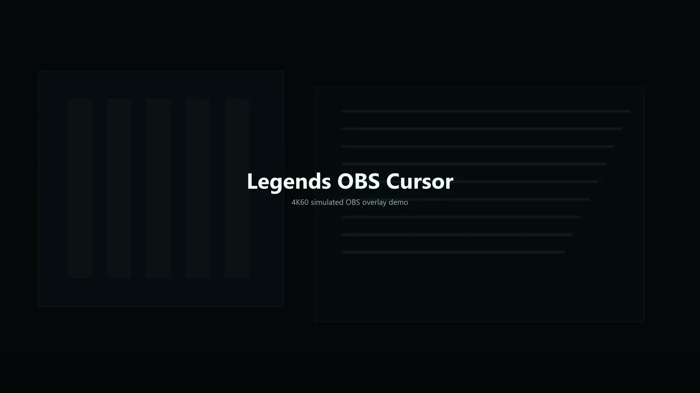
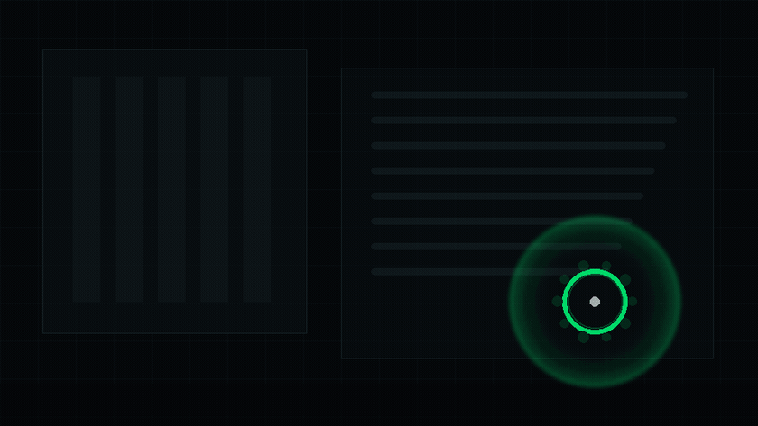

# Optional extra: animated cursor overlay

Adds the `Legends Cursor Filter` OBS video filter: cursor halo, momentum ticks,
click ripples, comet trail, and glow. Windows only (LuaJIT FFI into user32).
The kit works fully without it; install only if you want cursor visuals.

## Demo

Placeholder render: a deterministic simulation of the filter defaults, showing
floaty follow, speed-driven spin, rotating momentum ticks, comet trail samples,
left-click ripples, and the magenta right-click diamond burst. Colors are not
final; the look will be re-rendered from the Lua filter rules.

  

GIF fallback for viewers that do not animate WebP:

  

Regenerate from this folder with `python tools/render_assets.py` and
`python tools/render_showcase.py`. Visual rules live in `docs/ART_DIRECTION.md`.

## Install

1. Close OBS (or pass `-Force`).
2. Run `install_into_obs.ps1` from this folder in PowerShell on Windows.
   It copies the filter into the OBS scripts folder and backs up your scene collection.
3. In OBS, add the `Legends Cursor Filter` video filter to your display or window capture source.

## License

This extra is GPL-2.0-or-later, Copyright 2026 Avalon Reset (see LICENSE in
this folder, plus NOTICE and CREDITS.md in
this folder). It is a separable component; the rest of legends-obs-kit stays MIT.
It supersedes the former standalone legends-obs-cursor module: same filter, now housed here.
